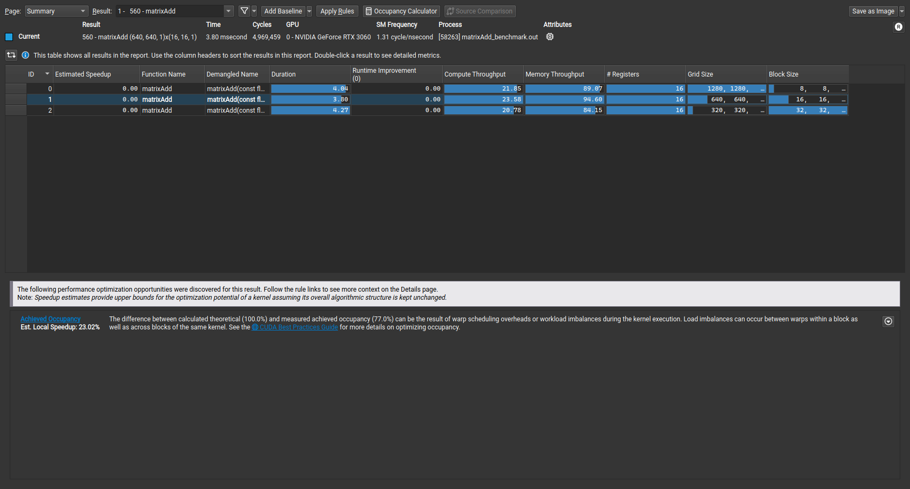

# Day 007 - Matrix Addition Performance Analysis with Nsight

## Objective
Analyze and benchmark matrix addition performance using different block sizes and CUDA Nsight profiling tools, focusing on optimizing thread block configurations.

## Concepts Covered
- CUDA Event-based Performance Timing
- Block Size Optimization
- Large Matrix Operations (10240 x 10240)
- CUDA Nsight Profiling
- Performance Analysis and Comparison

## Key Components
1. Performance Measurement:
   - CUDA Events for precise timing
   - Multiple block size configurations (8x8, 16x16, 32x32)
   - Kernel execution timing for each configuration

2. Matrix Configuration:
   - Large-scale matrix (10240 x 10240)
   - Multiple thread block sizes
   - Grid dimension calculations for different block sizes

3. Analysis Tools:
   - CUDA Event-based timing
   - Nsight Compute profiling
   - Performance comparison across configurations

## Key Learning Points
1. Impact of block size on kernel performance
2. Using CUDA Events for performance measurement
3. Understanding thread block optimization
4. Profiling CUDA applications with Nsight
5. Analyzing performance metrics for different configurations

## Building and Running
1. Compile with nvcc:
   ```bash
   nvcc matrixAdd_benchmark.cu -o matrixAdd_benchmark
   ```
2. Run with Nsight Compute:
   ```bash
   ncu ./matrixAdd_benchmark
   ```

## Notes
- Larger matrices provide better insights into performance differences
- Block size significantly impacts kernel execution efficiency
- Nsight Compute provides detailed performance metrics
- Important to consider hardware limitations when choosing block sizes
- Results may vary across different GPU architectures

## Performance Visualization
