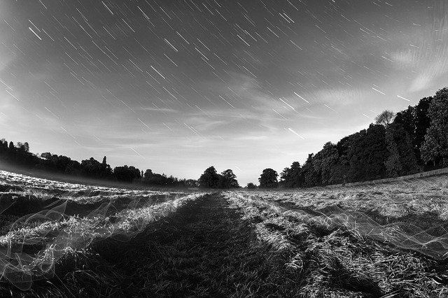
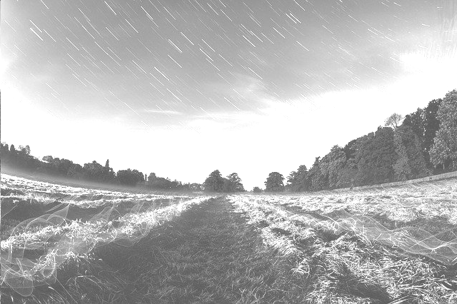

# Day 008 - Image Brightness Adjustment using CUDA

## Objective
Develop a CUDA-based image processing application that adjusts the brightness of a PGM (P5) image. This project demonstrates how to implement a CUDA kernel for pixel-level manipulation, manage host/device memory, and perform file I/O for image processing.

## Concepts Covered
- **CUDA Kernel Programming:** Implementing a kernel to modify image pixel values.
- **Memory Management:** Allocating and transferring memory between the host and GPU.
- **Image File I/O:** Reading and writing binary PGM images.
- **Error Handling:** Validating file operations and memory allocations, ensuring pixel values remain within [0, 255].

## Key Components
1. **PGM File Processing:**
   - Reads a binary PGM (P5) image and parses its header (format, width, height, and max value).
   - Validates that the image uses a max value of 255.

2. **CUDA Kernel Execution:**
   - The `brightness_adjust` kernel computes new pixel values by adding a user-specified brightness offset.
   - Implements clamping to ensure pixel values do not exceed the valid range [0, 255].

3. **Memory Management:**
   - Allocates memory on both the host and the GPU.
   - Copies the image data from the host to the device, and the processed data back to the host.

4. **Output Generation:**
   - Writes the modified image data back into a new PGM file with the proper header.

## Key Learning Points
1. **CUDA Fundamentals:**
   - Setting up and launching a CUDA kernel with appropriate grid and block dimensions.
   - Synchronizing device execution and managing data transfers between host and device.

2. **Image Processing Techniques:**
   - Adjusting image brightness with proper clamping to avoid overflow or underflow.
   - Handling binary image formats and ensuring accurate file read/write operations.

3. **Robust Error Handling:**
   - Checking file open/read/write operations.
   - Ensuring memory allocation is successful and managing resources effectively.

## Building and Running
1. **Compile the Code:**
   ```bash
   nvcc image_brightness.cu -o image_brightness.out
   ```

2. **Run the Application:**
   ```bash
   ./image_brightness.out picture.pgm brightness_adjusted_picture.pgm <brightness_offset>
   ```
   - Replace `<brightness_offset>` with an integer value (e.g., 50 to brighten or -30 to darken the image).

## Notes
- **Supported Format:** Only binary PGM (P5) images with a max pixel value of 255 are supported.
- **Brightness Adjustment:** The kernel ensures that the adjusted pixel values are clamped between 0 and 255.
- **Extensibility:** This project serves as a foundation for more complex image processing tasks using CUDA.
- **Hardware Requirements:** Ensure that your system has a CUDA-capable GPU and the CUDA toolkit is installed.

## Results
- The output image, `brightness_adjusted_picture.pgm`, reflects the applied brightness modification.
- This project showcases the efficiency of GPU-accelerated image processing, even for high-resolution images.


*Figure 1: Actual image with no adjustments.*


*Figure 2: Brightness-adjusted image output from CUDA program.*
